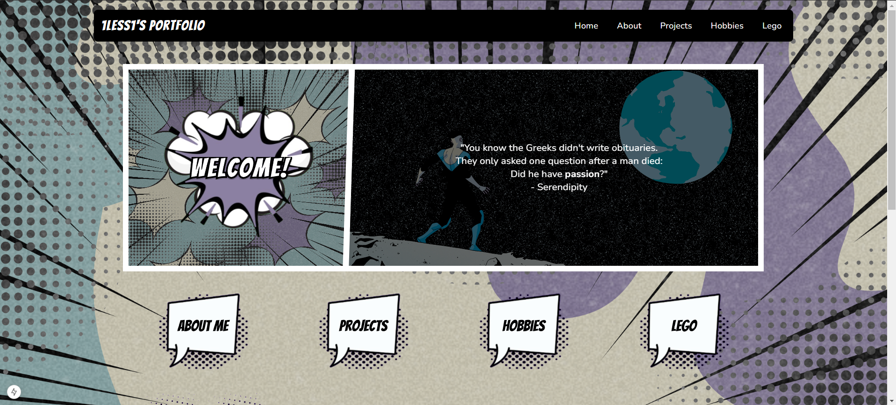
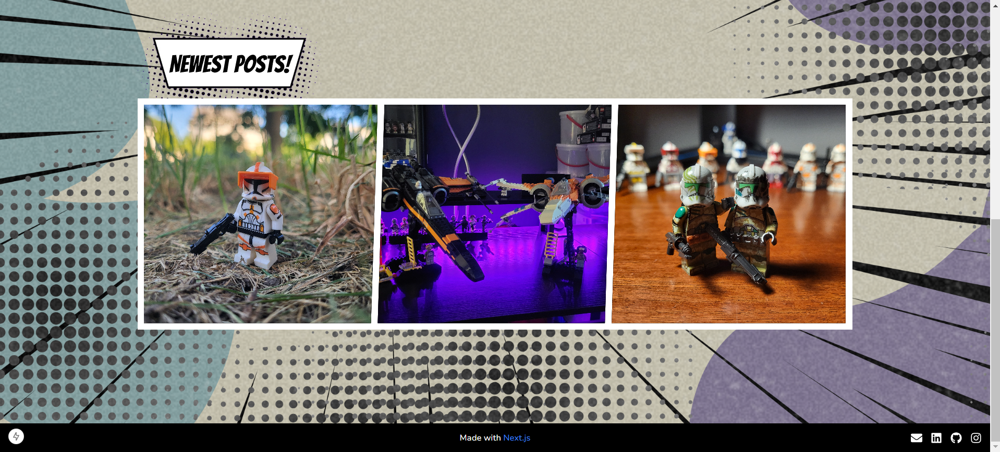
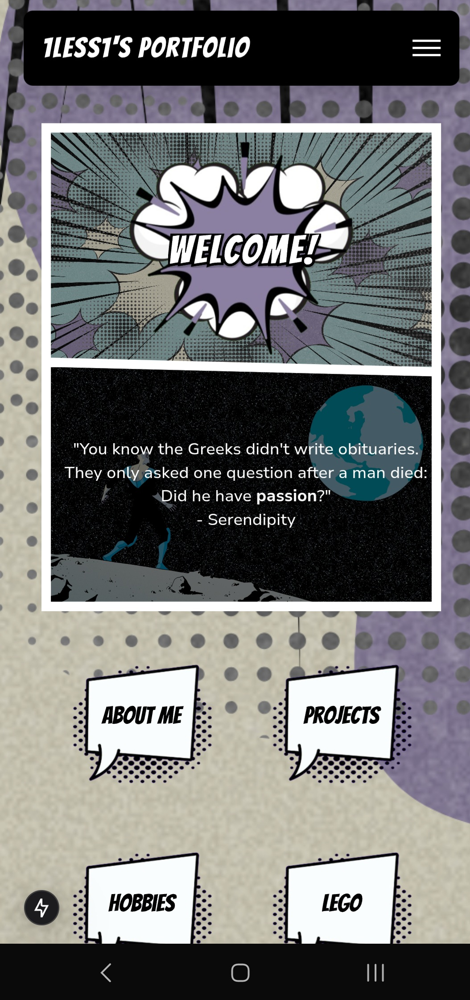
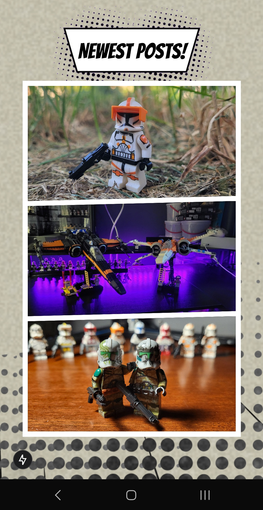

# next-js-portfolio

## About the Project
This portfolio website was coded from scratch using JavaScript as well as Tailwind and Standard CSS. It has a comic book theme and a lot of the custom graphics were made using Figma and Canva. The website showcases personal projects as well as some personality for code enthusiasts, lego lovers, and employers. I really enjoyed developing the website as I transitioned from a CMS (Wordpress) to learn JavaScript. Enjoy the source code!

### Built With:
* [](https://www.javascript.com/)
* [](https://tailwindcss.com/)
* [](https://nextjs.org/)
* [](https://nodejs.org/en)
* [](https://www.mysql.com/)


## Frontend
The frontend follows the Next.js framework using the "App Router" architecture. This architecute utilizes the app directory as the primary entry point for creating routes, replacing the older Pages Router. The website is 90% statically generated **client side**! Dynamic content is rendered **server side**.

### Key Features of the App Router (src/app):
- File-based Routing:
    - The app directory is used for defining routes and layouts. Each folder within app represents a route segment.
- Server Components by Default:
    - Components in the app ddocker --version
irectory are Server Components by default, enabling better performance and reduced client-side JavaScript.
- Layout and Template Management:
    - Nested layouts are defined in layout.js files, allowing you to share UI (e.g., navigation bars) across multiple pages.
- Improved Data Fetching:
    - With features like getServerSideProps and getStaticProps being replaced by direct asynchronous fetching in components, data handling is more intuitive.
- Colocation of Files:
- Files like loading.js, error.js, and layout.js can be colocated with their respective routes to manage ldocker --version
oading states, error boundaries, and layout

### Next.js Modules
Note: Run **npm install** in the next_frontend folder for a fresh clone. This will install all necessary dependencies!
```bash
npm install swiper
npm install react-icons
nom install dotenv
npm install xss
```
- swiper - used for image carousels
- react icons - used for footer icons
- dotenv - used for .env file compatibility

## Backend
To serve the Lego Blog on the website dynamically, the backend is made up of Node.js and a MySQL database.
Note: Run **npm install** in the node_backend folder for a fresh clone. This will install all necessary dependencies!
### Node.js Modules
```bash
npm install mysql2
npm install dotenv
npm install express
npm install express-rate-limit
npm install axios
npm install cors
npm install cross-env --save-dev
```
- mysql2 - used for MySQL integration
- dotenv - used for .env file compatibility
- express - used for API endpoints/routes
- axios - used to make HTTP requests streamlined and readable
- cors - used to allow a different origin (web socket) to make requests to the server
- cross-env - used to make evironment variable declarations compatible with windows and linux
docker --version

## Fonts
**Bangers** - google font for comic book punchlines (headers)

**Coda** - google font for comic book text (website info, navbar, captions, etc.)

**Nunito** - google font used for the default font for all website content

## Colors
- Blue = #94b6b7
- Purple = #8b7fa2docker --version

- Tan = #e2ddc6

## Hosting

### Localhost
```bash
npm run dev
```
- Website will be available at http://localhost:[NEXT_PORT]
- Backend will be available at http://localhost:[NODE_PORT]

### Local Network
```bash
ifconfig # ipconfig on Windows
npx next dev -H 0.0.0.0
```
- Website will be available in a browser at http://[YOUR_IP]:[NEXT_PORT]  
(Great for testing Mobile Displays!)

### Docker Compose
Builds and runs docker containers that will host the proxy, frontend, backend, and db.

#### Development
Build Containers:
```bash
docker compose up --build
```

Run Containers:
```bash
docker compose up
```

#### Production
Build Containers:
```bash
docker compose -f docker-compose-prod.yml up -d --build
```

Run Containers:
```bash 
docker compose -f docker-compose-prod.yml up -d
```

#### Stop Containers
Stops and Removes all docker containers defined in docker-compose.yml.
Does **NOT** remove build cache or volumes:
```bash
docker compose down
```

Stops all docker containers and deletes the current build (used to create a fresh deployment with website changes)
- **IMPORTANT**: Make sure to backup all db data from docker volumes before doing this!!!
```bash
docker compose down --rmi all --volumes
```

Docker Deletion Commands:
```bash
docker image prune -a -f # deletes unused images
docker builder prune -f # deletes unused (stale) build caches
docker volume prune -f # deletes unused volumes 
docker system prune -a -f --volumes # remove everything at once!
```

#### Other
Docker Log Command:
```bash
# Allows you to see the logs for the current cluster in real time (runs in foreground)
docker compose logs -f
```

Clear Bash History on VPS:
Clears session bash history and overwrites the .bash_history file with nothing (null) efectively clearing it!
```bash
history -c && history -w
```

## Desktop Screenshots
<div align="center">
  
  
</div>

## Mobile Screenshots
<div style="display: flex; justify-content: center; align-items: center; height: 100vh; gap: 10px;">
  

  
</div>

### Manual Setup
VPS Server setup notes can be found [HERE](./notes/setup.md)  
Public Repo Publishing notes can be found [HERE](./notes/public_repo_publishing.md)  